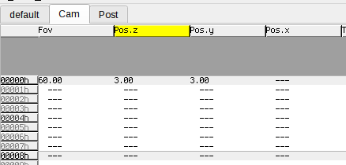

# Simple Linux demo in C

Welcome. This is a C99 codebase which will let you get started with creating
native OpenGL demos on Linux. The repository is structured so that
[`data/`](data/) contains binary files (assets such as music),
[`shaders/`](shaders/) contains shaders,
[`src/`](src/) contains source code,
[`scripts/`](scripts/) contains scripts
that are required for building the demo and
[`lib/`](lib/) contains third-party libraries (git submodules).

The result is an executable which shows some GLSL shaders with music,
sync and post processing, and won't depend on any other files.
We've chosen to compile and statically link all libraries except for libc,
so that the released production depends on least possible stuff.

## First-time setup

Warning! This project fails to build if it is stored in a path with spaces.
For example `/home/user/My Projects/linux_demo` won't work. This is due to
fundamental limitations in SDL2's build process.

First we need to fetch some third-party libraries:

```
git submodule update --init
```

You will need a C compiler (`gcc` or `clang` recommended) and some library
headers. This repository does not use a fancy build system, opting to use just
GNU `make` for simplicity.

### Ubuntu and Debian

```
sudo apt install build-essential xxd libsdl2-dev libsamplerate-dev
```

### Arch Linux

```
sudo pacman -S base-devel vim sdl2 libsamplerate
```

## Building

Just run

```
make -j $(nproc)
```

This will use all CPU cores you have available.

## Default workflow

0. Put your `music.ogg` file into `data` directory.
1. Edit [`src/config.h`](src/config.h) to match your desired resolution and **your music track's BPM**! Don't skip this. Then run `make` once more.
2. Open your [rocket](https://rocket.github.io/) editor. I prefer the default Qt-based rocket editor.
3. Start `./build/demo`
4. Open [`shaders/shader.frag`](shaders/shader.frag) in your editor.
5. Hack on shaders! Uniforms prefixed with `r_` will automatically show up in rocket.
6. Reload shaders and uniforms by pressing R. No `make` or restart needed.

### What if my music track is not in .ogg vorbis format?

It can be encoded with the following command:

```
ffmpeg -i YOUR_MUSIC_FILE -c:a libvorbis data/music.ogg
```

## Camera control

The default [`shaders/shader.frag`](shaders/shader.frag) includes a "look at"
-style camera for SDF raymarching. It's variables will show up in Rocket as
tracks, and before you set reasonable values to them, nothing will render.



A good starting point is to set Fov to some value between 45 and 90,
Pos.z to 3, leave Target as all zeroes (the origin).
Also try and see what other rocket tracks do.

## Releasing

Your demo is getting ready and you want to build a release build? Just run

```
make -j $(nproc) DEBUG=0
```

This builds a `release/demo` which can be copied anywhere and won't need the
rocket editor to run.

:warning: **Please note: glibc version will prevent running the demo on older distro releases** :warning:

For example: if you build a release build on an Arch Linux which has `glibc 2.37`,
the demo cannot run on an Ubuntu 22.04 because it ships with `glibc 2.35`!

To avoid this gotcha, you must build your release on the same (or possibly older)
distribution release as the intended target platform (compo machine).
One way to do that is to use a container system like docker or [podman](https://podman.io/) to build your release.

Example run for `podman`, as your normal user:
```
make clean
podman run -it --rm -v.:/build ubuntu:20.04
apt-get update && DEBIAN_FRONTEND=noninteractive apt-get -y install build-essential xxd libsdl2-dev libsamplerate-dev libudev-dev
cd /build
make -j $(nproc) DEBUG=0
mv release/demo .
make clean
exit
```

Instructions for installing podman on Arch Linux can be found on the [Arch Wiki](https://wiki.archlinux.org/title/Podman).

### Optional: compress the executable

[`scripts/`](scripts/) has a [shell-dropping](https://in4k.github.io/wiki/linux#compression)
packer which doesn't depend on anything special.
This can reduce about half MB from filesize.
However, this may reduce compatibility as it requires xz-utils
to be installed and /tmp directory to allow executables.

```
scripts/pack.sh release/demo
```

## Overview of libraries and code

We use the industry-standard [SDL2](https://www.libsdl.org/) library as a base for audio output,
keyboard (quit-button), windowing and OpenGL context creation.

[OpenGL](https://docs.gl) along with your graphics card drivers does the heavy lifting for
rendering your demo.

[stb_vorbis](https://github.com/nothings/stb/blob/master/stb_vorbis.c)
is a single C source file audio codec library for OGG Vorbis,
which we use to avoid having to release a huge file with uncompressed audio.

And finally, [rocket](https://rocket.github.io/) is a sync tracker along with a library to edit
your demo's synchronization with music without having to change code and recompile.

The [`src/`](src/) directory contains about 1000 lines of commented C99 code,
which you can read starting from any file.

Here is is a list of the source units in (subjectively) decreasing order of importance:
- [`main.c`](src/main.c): Initializes window, OpenGL context, audio, music player, rocket. Contains demo's main loop.
- [`demo.c`](src/demo.c)/[`demo.h`](src/demo.h): Most OpenGL calls happen in this unit.
- [`shader.c`](src/shader.c)/[`shader.h`](src/shader.h): Utilities for loading and compiling shaders.
- [`uniforms.c`](src/uniforms.c)/[`uniforms.h`](src/uniforms.h): Contains code for querying uniforms in shader programs.
- [`music_player.c`](src/music_player.c)/[`music_player.h`](src/music_player.h): Music player with OGG Vorbis streaming, seeking and timing support for sync editor.
- [`filesystem.c`](src/filesystem.c)/[`filesystem.h`](src/filesystem.h): Includes `data.c` which [`scripts/mkfs.sh`](scripts/mkfs.sh) generates at build time. Has functions for reading embedded files.
- [`rocket_io.c`](src/rocket_io.c)/[`rocket_io.h`](src/rocket_io.h): This file hosts rocket `sync_io_cb` (I/O callback) code for rocket to load tracks from embedded files.
- [`rand.c`](src/rand.c)/[`rand.h`](src/rand.h): A xoshiro PRNG implementation, mostly used for post processing noise.
